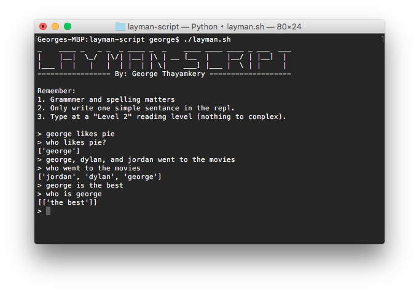

# layman-script

<p align="center">

</p>

A sentence parser that identifies subjects and verbs and stores them into memory. Questions (who or what questions) can also be queried in order to get certain responses.

## Example
layman-script works best with simple sentances
```
> George likes pie
```
Now you can ask...
```
> Who likes pie?
'george'
> Does George like pie?
[True]
> What does George like?
['pie']
```
You can also include multiple subjects and/or verbs
```
> George, Dylan, and Jordan went to the movies
> Who went to the movies?
['george', 'dylan', 'jordan']
```
## How to install
Install with pip
```
$ pip install git+https://github.com/geooot/layman-script.git
```

## Dependencies:
 * Python 3 (For REPL otherwise python2 will work)

## How to use:
For REPL use:
```
$ ./layman.sh
```
or 
```
$ python3 main.py
```

For file input:
```
$ python3 main.py -f "pathtofile.txt"
```
